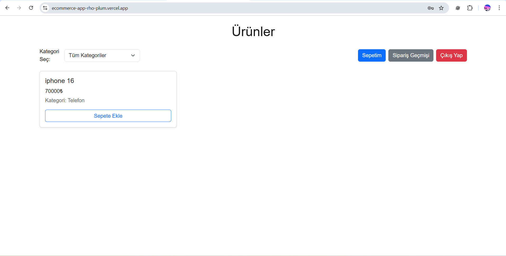
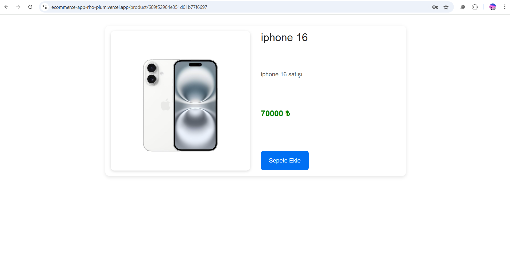
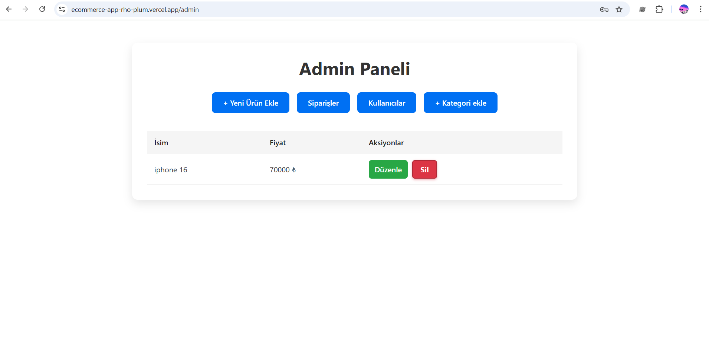

# 🛒 E-Commerce App

Modern e-ticaret uygulaması. Kullanıcılar ürünleri görüntüleyebilir, sepete ekleyebilir ve sipariş verebilir. Admin paneli üzerinden ürün, kategori ve kullanıcı yönetimi yapılabilir.  

## 🚀 Projenin Amacı
Bu proje, **Node.js + Express**, **MongoDB** ve **React** kullanılarak fonksiyonel bir e-ticaret platformunun nasıl geliştirileceğini göstermek amacıyla yapılmıştır.  

## 🛠 Kullanılan Teknolojiler
- **Frontend:** React, React Router, Axios, CSS (TailwindCSS / Vanilla CSS)  
- **Backend:** Node.js, Express.js  
- **Database:** MongoDB, Mongoose  
- **Authentication:** JWT, bcrypt  
- **Ortam Değişkenleri:** dotenv  
- **API Testi:** Swagger  

### Kullanıcı Hesabı
- **Email:** admin@gmail.com 
- **Şifre:** Admin123@  

## 📬 Swagger Koleksiyonu
👉 (🟢https://ecommerce-app-1-bpok.onrender.com/api-docs)

## 🌍 Canlı Demo
- **Frontend:** (🟢https://ecommerce-app-rho-plum.vercel.app/)
- **Backend API:** (🟢https://ecommerce-app-1-bpok.onrender.com/)  

## 📸 Örnek Ekran Görüntüleri
### Anasayfa

### Ürün Detayı

### Admin Panel

